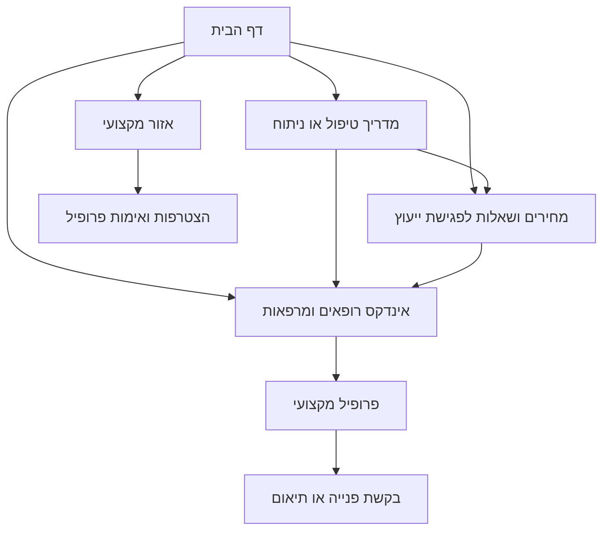

# Hea-lth public experience direction, V1

Date: 2026-07-10  
Status: visual concept for review only  
Public release: not approved, not deployed, and not activated

## The public we are designing for

The homepage speaks first to people making a health or appearance-related decision. It does not speak to Google, advertisers, providers, internal teams, or software tools.

### Primary public

1. Someone exploring a treatment for the first time. They need a plain explanation, the main questions to ask, and a sense of what a consultation involves.
2. Someone comparing a procedure, a price range, or a way to pay. They need to understand what changes the price before they contact anyone.
3. Someone looking for a plastic surgeon, physician, clinic, or private diagnostic provider. They need a search that starts with the reason for the visit and narrows by area and payment path.
4. Someone returning after research. They need a clear route back to a guide, a profile, a comparison, a saved choice, or a request.

### Secondary public

Plastic surgeons, hair-transplant physicians, aesthetic physicians, dermatologists, clinics, private diagnostic providers, and later eligible device suppliers. They receive a separate professional path after the visitor path is clear. They do not take over the public homepage.

## Public language rules

The public vocabulary is deliberately familiar. It uses the words that appear in Israeli treatment and provider search journeys:

- טיפול, ניתוח, רופא או רופאה, מנתח או מנתחת פלסטית, מרפאה, אזור, מחיר, מסלול תשלום, פגישת ייעוץ, זמן החלמה, חוות דעת נוספת.
- Search labels: מה מחפשים, איפה, מסלול תשלום.
- Decision labels: מה כולל המחיר, מה חשוב לשאול, איזה ניסיון רלוונטי, מה קורה לפני ואחרי הפגישה.

The public experience must not say SEO, דירוג בתשלום, ליד, CRM, ספק, מונטיזציה, או AI. These are not visitor language.

Do not use superlatives or outcome promises. Avoid phrases such as הטוב ביותר, תוצאה מושלמת, בטוח לחלוטין, מחיר מובטח, or doctor recommended by the platform. A profile may be described as verified only when the verification data and methodology are visible and current.

The visual concept contains no em dash or en dash characters. Its sentence rhythm uses short Hebrew sentences and clear nouns instead of generic promotional language.

## Competitor language evidence and the Hea-lth translation

| Evidence observed | Why it matters to a visitor | Hea-lth public treatment |
| --- | --- | --- |
| [MedReviews aesthetic directory](https://www.medreviews.co.il/search/aesthetic-medicine) uses the task language רפואה אסתטית, שם רופא / טיפול / מומחיות, אזור בארץ, שפות, and בהסדר עם. | A visitor naturally starts with provider, treatment, location, language, and payment route. | Homepage search uses מה מחפשים, איפה, and מסלול תשלום. The eventual directory has fields for specialty, location, languages, payment path, credentials, and last verification. We will not reuse the word מומלצים until a transparent methodology exists. |
| [MedReviews hair-transplant directory](https://www.medreviews.co.il/search/treatment/hair-transplant) is structured around השתלת שיער, physician search, region, and treatment-specific provider profiles. | Hair-transplant visitors expect a treatment path and a local provider path, not a generic wellness landing page. | Hair transplant is a visible homepage route with a dedicated future treatment page, price guide, consultation questions, and plastic-surgeon or physician discovery path. |
| [Estheticare](https://www.estheticare.co.il/) positions its content around guides, treatment information, price comparison, and finding a clinic or doctor. | The audience expects an explanation before it contacts a clinic. | The home page sends a visitor to a guide before asking for a contact request. A price page will explain the price variables and source method before it offers a next step. |
| [RealSelf Botox cost guide](https://www.realself.com/nonsurgical/botox/cost) combines a cost question with why costs vary and a provider route. [RealSelf hair-transplant cost guide](https://www.realself.com/surgical/hair-transplant-surgery/cost) does the same for a high-consideration procedure. | Price alone is not enough. People need context, alternatives, and questions for a clinician. | Price is a decision route, never a bare sales claim. A treatment guide will separate facts, source-backed cost factors, limitations, and the option to find a professional. |
| [Zocdoc search methodology](https://www.zocdoc.com/about/how-search-works/) begins with reason for visit, location, insurance, and availability. It also publishes a description of how search works. | A provider search works when it reflects the reason someone needs care, rather than forcing medical jargon. | Hea-lth begins with what the visitor is looking for, where, and payment path. Availability will not appear until real provider availability data exists. Search and sponsored-placement rules must be publicly documented before directory launch. |

## What the live Google Israel search told us

On 2026-07-10, a Chrome search for `השתלת שיער` displayed an informational overview about the procedure, technique terms, recovery, and a local treatment result. The result is consistent with the public routes above: explain the procedure, answer the price and recovery questions, then let the visitor find a relevant professional. It is not a justification for copying result text or competitor prose.

## Visual decisions in the first concept

1. The opening screen is a choice and search screen. It is not a corporate statement and it is not a long article.
2. The first interaction mirrors real provider search behavior: reason or treatment, location, and payment path.
3. Plastic surgery is a first-class route. It is visible in the main navigation, a route card, treatment cards, the directory model, and the professional entrance.
4. The directory is shown as a trustworthy data product, not a wall of celebrity cards. The visual prototype uses generic profile cards so it does not invent people, ratings, licenses, or reviews.
5. The professional route is secondary on the public home. It has a stronger dedicated future screen for plastic surgeons, clinics, and other professionals.
6. Stock photography is used only for this visual concept. It is not AI-generated. Production use requires a license and an approved image policy.
7. Advanced features such as 3D models, simulation, AI navigation, maps, and comparison trays are not displayed as empty novelty. They belong only where they make a treatment, provider, or device decision clearer and where their evidence and operating model are ready.

## Main navigation and future mega-menu map

| Main menu | First visible destinations | Future menu depth |
| --- | --- | --- |
| אסתטיקה וטיפולים | בוטוקס, חומצה היאלורונית, טיפולי עור, לייזר | פנים, צוואר, גוף, שיער, עור, מדריכי החלטה, מחירים, רופאים |
| ניתוחים פלסטיים | ניתוח אף, ניתוחי חזה, פנים, גוף | לפי ניתוח, זמן החלמה, שאלות לייעוץ, מחירים, מנתחים פלסטיים, מרפאות |
| שיער ועור | השתלת שיער, נשירת שיער, PRP, עור | טיפול, שיטות, מחירים, החלמה, רופאים ומרפאות |
| רפואה פרטית | חוות דעת נוספת, בדיקות, שירותים פרטיים | התמחויות, בדיקות, בתי חולים ומרפאות, מסלולי תשלום |
| רופאים ומרפאות | חיפוש, תחומים, אזורים | פרופילים, התמחות, אזור, שפות, נגישות, מסלולי תשלום |
| מדריכים ומחירים | שאלות לפגישה, מחירים, הכנה | טיפול, ניתוח, החלמה, עלויות, מילון מונחים |

## Core screen sequence

## Screens still required before theme approval

1. Plastic-surgeon directory with filters, transparent results method, map behavior, and no false ratings.
2. Hair-transplant treatment decision page with method comparison, recovery, price methodology, sources, reviewer area, and provider route.
3. Plastic-surgeon profile with credential source, clinics, services, languages, payment route, last verified date, and safe contact path.
4. Price-comparison page with source date, included and excluded items, factors that change price, and no invented ranges.
5. Patient account and saved-comparison screen.
6. Professional onboarding, profile verification, and profile preview screen.

## Approval boundary

This file and the HTML concept are planning artifacts only. No WordPress theme is activated, no public page is changed, no provider claim is published, and no pull request is opened by this design review.
