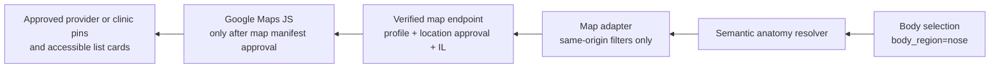

# Directory map runtime and release gate

Date: 2026-07-11  
State: source foundation validated locally, not configured, not live, and not connected to the current WordPress site.

## Outcome

The anatomy experience now has a real, gated path from a semantic body selection to a verified directory-map query. It does not use mock clinics, placeholder map pins, mesh identifiers, free-form location input, or a permanently loaded third-party map.

## Data and safety boundaries

| Boundary | Enforced behavior |
| --- | --- |
| Anatomy | Emits semantic `specialty`, `bodyRegion`, `region`, and `service` filters. It does not send renderer mesh names to the directory API. |
| Provider and clinic | A record must be published, `hp_public_state=verified`, `hp_map_public_state=approved`, and country-scoped to `IL`. |
| Location fields | Latitude, longitude, and precision are typed, range-validated, and separately reviewable. Street address, contact details, page body, lead data, and sponsorship state are not returned by the map endpoint. |
| Commercial ranking | Map results remain title-ordered after relevance filters. Paid placement cannot push a provider ahead of a better semantic match. |
| Map vendor | Google Maps loads only after an approved map manifest includes a restricted browser key, Map ID, exact allowed origin, owner, review date, key-restriction review, location-data review, and commercial-disclosure review. |
| Failure | If any configuration or data gate fails, the map stays unavailable and the text anatomy, treatment, and directory routes remain available. No fallback pins are invented. |

## Runtime behavior

1. The theme renders the map shell with no third-party script by default.
2. A visitor selects a body region and context.
3. The map adapter receives the semantic event. If no approved map configuration exists, it stays closed and explains why.
4. Only with an approved configuration, the adapter loads the Maps JavaScript API on demand, using Hebrew, Israel region behavior, a Map ID, and origin-minimized referrer policy.
5. It requests `hea-lth/v1/directory/map` with a bounded same-origin query.
6. The endpoint returns only narrow, verified map markers. The client renders cards through DOM text nodes and focuses the real map when a card is selected.

Google documents dynamic library loading and `importLibrary()` for runtime loading, including `maps` and `marker` libraries. It also requires a valid API key, supports language and region parameters, and describes origin-based referrer policy. [Google Maps JavaScript loading guidance](https://developers.google.com/maps/documentation/javascript/load-maps-js-api) Google also says API keys must be restricted to appropriate applications and APIs to prevent unauthorized usage and charges. [Google Maps API security guidance](https://developers.google.com/maps/api-security-best-practices)

## Source evidence

- `plugin-src/hea-lth-platform-core/includes/class-hea-lth-directory-map-registry.php` implements the configuration gate.
- `plugin-src/hea-lth-platform-core/includes/class-hea-lth-directory-controller.php` provides the bounded map endpoint.
- `theme-src/hea-lth-portal/assets/js/anatomy-directory-map.js` provides deferred map loading and marker interaction.
- `tooling/tests/directory-map-registry-test.php`, `tooling/tests/directory-map-contract-test.php`, and `tooling/tests/directory-map-endpoint-test.php` passed.

## Release prerequisites

1. Create a Google Cloud project owned by Hea-lth, with billing owner, budget alerts, Maps JavaScript API enabled, a browser key restricted to the exact production and staging origins, and a production Map ID.
2. Record the restricted browser key and Map ID in the approved WordPress manifest. Do not place server keys, unrestricted keys, or patient data there.
3. Populate verified provider and clinic records, then obtain a separate documented approval for each public location and its precision.
4. Perform Chrome desktop and mobile verification with the real restricted key, map consent and disclosure copy, RTL controls, keyboard navigation, visual contrast, error behavior, marker behavior, and map loading performance.
5. Approve the lead consent and CRM handoff separately. The map endpoint is read-only and does not create or route leads.
