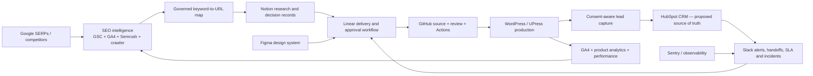

# Hea-lth Enterprise Tooling Registry

**Date:** 2026-07-10  
**Scope:** hea-lth.co.il, its provider marketplace, premium-health content operation, lead revenue system, design system, deployment platform, analytics, research, and future international expansion.  
**Operating rule:** zero friction, zero blockers, zero ungoverned access.

## 1. Executive decision

Hea-lth does not need the largest possible number of tools. It needs complete capability coverage with one accountable system of record for each business function. Every proposed plugin, MCP server, extension, CLI, and SaaS product is therefore placed in one of five states:

1. **Connected and verified** — callable now and tested with a low-risk read.
2. **Installed, activation required** — code/configuration exists but a restart or OAuth connection is still required.
3. **Install next** — evidence supports it and its role is not duplicated.
4. **Decision or commercial gate** — requires a product choice, paid plan, license, DPA/BAA review, or named data owner.
5. **Rejected/deferred** — duplicates the stack, creates unacceptable permissions or lock-in, or lacks credible provenance.

“Listed in an MCP registry” does not mean “security approved.” The Official MCP Registry is a discovery layer and explicitly disclaims guarantees about server safety. Admission requires provenance review, least privilege, pinning, secret isolation, logging, and a revocation path.

## 2. Enterprise operating topology

No tool may silently become a second CRM, a second keyword map, or a second deployment authority.

## 3. Current verified inventory

### 3.1 Connected and callable now

| Capability | Tool | How Hea-lth will use it | Authority and boundary | Verified state |
|---|---|---|---|---|
| Source and delivery | GitHub plugin, `git`, `gh`, GitHub Actions | Version control, PR review, CI, deterministic WordPress packages, deployment evidence, rollback | GitHub is code truth; production deploys only from protected workflow/environment | Connected; repository/admin access verified |
| Browser with authenticated state | Codex Chrome plugin | Work in existing authenticated WordPress, GSC, ChatGPT, Slack, and research tabs | Authenticated browser actions remain confirmation-gated when an external side effect is consequential | Connected |
| Design | Figma plugin | Native editable wireframes, design tokens, component library, screen system, Code Connect | Figma is visual/design truth; design does not publish code directly | Connected; rich read/write toolset visible |
| Design exploration only | Lovable plugin | Competitor/design exploration and research prompts | **Never** used to build or deploy Hea-lth; no Lovable cloud dependency in production | Connected with explicit scope restriction |
| Delivery management | Linear plugin | Initiatives, projects, issues, acceptance criteria, launch gates | Linear is work status, not knowledge or CRM truth | Connected |
| Knowledge and research | Notion plugin | Research library, decision records, medical-review logs, competitive evidence, SOPs | No patient clinical records; canonical keyword map remains versioned/exportable | Connected after retry; 20+ tools visible |
| Documents and communication | Google Drive, Docs, Sheets, Slides, Gmail plugins | Research packs, structured analysis, stakeholder deliverables, controlled email workflows | Explicit confirmation for sending/mutating external communications | Connected |
| Team coordination | Slack plugin | Channel reads/writes, canvases, files, reminders, search, approvals and incident coordination | Slack is coordination only; CRM remains source of truth; no patient medical data | Plugin installed; 34 actions callable; currently authorized only to workspace `justice`, **not** Hea-lth |
| WordPress administration | Authenticated WordPress browser session | Plugin/bootstrap administration, temporary deployment bridge, verification | Application Password will be revocable and stored only as GitHub encrypted secrets | Admin session verified; deployment credential still awaiting explicit confirmation |
| Search evidence | Authenticated Google Search Console UI | Current query/page/CTR/position evidence and preservation decisions | Read-only research; full API connection is still pending | Domain property verified; current 3-month evidence captured |
| Scientific/AI ecosystem | Hugging Face plugin/skills | Evaluate or prototype local/browser models where justified | No model training on patient data without a separate governed program | Available |
| Documents/visuals | Canva plugin | Business presentations and social-format derivatives | Not the core product design system | Available |

### 3.2 Installed command-line and quality infrastructure

| Tool | Purpose | State |
|---|---|---|
| PHP 8.3.31 | Local WordPress/PHP validation | Installed and configured |
| Composer 2.10.2 | Reproducible PHP dependencies and quality tooling | Installed; diagnose passes |
| WP-CLI 2.12.0 | Scriptable WordPress operations when host access is available | Installed; release signature verified |
| actionlint 1.7.12 | GitHub Actions workflow validation | Installed; checksum verified |
| Gitleaks 8.30.1 | Secret scanning before commit/deploy | Installed; checksum verified |
| axe-core CLI 4.12.1 | Automated accessibility diagnostics | Repository-pinned with lock file; npm audit reports zero known advisories |
| WordPress Coding Standards 3.3.0 + PHPCompatibilityWP 2.1.8 | WordPress conventions and PHP 8.1+ compatibility | Repository-pinned; first-party plugin checks pass |
| PHPStan 2.2.5 + WordPress stubs | Static analysis of first-party WordPress code | Repository-pinned; level 5 analysis passes |
| Dependabot | Weekly reviewed updates for Actions, Composer and npm | Configuration added; updates arrive as reviewable PRs |
| WordPress deploy builder/runner | Deterministic ZIP, manifest, SHA-256, health check and rollback | Implemented in repository; tests pass pending final re-run after latest patch |
| Reusable `wordpress-agent-deploy` skill | Repeatable deployment and incident playbook | Installed and validated |

### 3.3 Installed/configured but restart or authentication is required

| Tool | Why it matters | Remaining activation |
|---|---|---|
| Semrush plugin/MCP | Keyword, competitor, backlink, traffic, paid-search, project and site-audit evidence | Restart/new task so plugin tools surface, then authenticate an API-enabled Semrush account |
| BioRender plugin | Scientifically credible diagrams and medical figures | Restart/new task and authenticate; preserve licensing/attribution constraints |
| Life-science research plugin | Scientific literature and evidence gathering | Restart/new task and authenticate as required |
| OpenAI Developer Docs MCP | Current first-party OpenAI/Codex/API guidance | Configured; new task/restart to surface reliably |
| Playwright MCP | Persistent exploratory browser automation and self-healing QA loops | Configured in isolated, headless Chrome; new task/restart required |
| Chrome DevTools MCP | Network, console, performance traces and deep browser debugging | Configured isolated with usage statistics disabled; new task/restart required |
| Curated skills | Playwright, screenshots, security review/threat model, PDF, notebooks, CLI creation, Figma design-system implementation, Notion workflows, Sentry, speech and transcription | Installed globally; new task/restart required to load catalog |

### 3.4 Partially installed or technically blocked

| Tool | Current truth | Required resolution |
|---|---|---|
| Screaming Frog SEO Spider | Legacy 13.2 installed. Official 24.3 signed installer downloaded and verified, but the Windows installer fails because local WMI classes return `Invalid class` | Repair WMI from an elevated Windows shell, install 24.3, add a paid license if MCP/large crawls require it, then connect the official MCP with an explicit crawl-output directory |
| New Hea-lth Slack workspace | Signup has reached Slack human verification | User completes or explicitly authorizes the CAPTCHA attempt, workspace is named `Hea-lth`, then Slack plugin is re-authorized and workspace ID verified |

## 4. Why Slack is being installed

Slack is the enterprise **coordination and alerting nervous system**. It is not the lead database, content database, medical record, or project plan.

### Proposed channel architecture

| Channel | Purpose | Automated events |
|---|---|---|
| `#exec-leadership` | Weekly decisions, KPI exceptions, strategic risks | Approved weekly scorecard only |
| `#leads-incoming` | Minimal-data notifications for new qualified leads | CRM record link, service category, region, consent state, owner |
| `#lead-sla` | Acknowledgement and routing exceptions | Unclaimed lead timers, reassignment, escalation |
| `#provider-onboarding` | Provider verification, contract and profile readiness | Stage changes and missing-document reminders |
| `#editorial-medical-review` | Medical-review queue and publication gates | Brief/article links, reviewer, evidence freshness, approval result |
| `#seo-serp-lab` | SERP changes, keyword-map decisions and tests | Ranking/CTR anomalies and approved content opportunities |
| `#competitive-intelligence` | Daily Israel/global benchmark digest | Daily automation summary with evidence links |
| `#product-design` | Figma reviews, component decisions and usability findings | Figma/Linear links and review requests |
| `#deployments` | Build, preview, production and rollback status | GitHub Actions and WordPress health-check results |
| `#incidents` | Operational incidents with owner and timeline | Sentry/uptime alerts and severity routing |
| `#partnerships-sales` | Provider, device, clinic and commercial pipeline collaboration | CRM stage changes and tasks, without sensitive clinical details |

### Lead-routing pattern

1. WordPress validates consent and creates a lead in the CRM.
2. CRM deduplicates, classifies service/value/region/language, and assigns an owner.
3. Slack receives only the minimum operational alert plus a CRM link.
4. Owner acknowledges within the service SLA.
5. CRM—not Slack—records contact attempts, qualification, outcome, commission and attribution.
6. Unacknowledged or rejected leads escalate automatically and remain auditable.

### Slack data prohibition

Do not place diagnoses, medical histories, medications, laboratory results, imaging, identity documents, or free-text patient narratives in ordinary Slack messages. Slack channels may contain operational identifiers and links only after privacy/legal review of the exact plan, retention, region, DPA and permissions.

## 5. Install/connect next — prioritized program

### P0: foundation blockers

| Capability | Recommended tool | Business outcome | Gate |
|---|---|---|---|
| Correct production delivery | GitHub Actions → WordPress application password bridge | Tested, auditable, reversible deployments without dashboard plugin updates | Explicit credential-creation confirmation; set `WP_USER` and `WP_APP_PASSWORD` secrets; first controlled deployment |
| Hea-lth coordination | Slack curated plugin + new `Hea-lth` workspace | Department channels, lead-SLA alerts, approvals, incidents, daily briefs | Complete human verification and re-authorize correct workspace |
| First-party organic truth | Google Search Console API with `webmasters.readonly` | Governed 16-month exports, query/page/device/country analysis, daily deltas | Create Google Cloud OAuth client or approved service-account/user flow; read-only scope |
| Conversion truth | GA4 Data API + Google Tag Manager governance | Lead funnel, source/medium, service revenue attribution and dashboarding | Verify property/container ownership and consent configuration; read-only API first |
| Market/competitor truth | Semrush official MCP/API | Israeli keyword volumes, SERP competitors, gaps, backlinks, paid intent and rank projects | Restart/auth; API-capable subscription and usage budget |
| Technical crawl truth | Screaming Frog 24.3 official MCP | Crawl, rendering, status/canonical/internal-link/schema checks at portal scale | Elevated WMI repair, current install, license, controlled crawl configuration |

### P1: revenue, analytics and reliability

| Capability | Recommended tool | Decision |
|---|---|---|
| CRM and monetization | **HubSpot CRM** with its official remote MCP | Preferred lead/customer/provider/deal source of truth. Start read-only; add constrained writes after schema, consent, dedupe, routing and audit design are approved. Requires account/plan and OAuth app decision. |
| Operations beyond product delivery | monday.com MCP | Add only if Linear cannot serve provider operations and recurring non-software workflows. Do not run Monday and Linear as competing project truths. |
| Product behavior | PostHog or Microsoft Clarity, with strict redaction/consent | Select one session-replay/product-behavior layer after privacy review. GA4 remains marketing/conversion truth. Disable capture on medical/free-text form fields. |
| Error tracking | Sentry + official MCP/skills | Capture custom plugin/JS failures, performance regressions and release correlations. Scope tokens to the Hea-lth organization/project. |
| Infrastructure observability | Grafana/OpenTelemetry | Add when infrastructure metrics/logs/traces justify it; Sentry alone is enough during the first WordPress custom-code phase. |
| Reporting warehouse | BigQuery + Looker Studio | Daily immutable facts from GSC, GA4, CRM, Semrush and crawl outputs; executive and SEO dashboards. Requires data model, budget and retention policy. |
| Backlink cross-check | Ahrefs | Commercial decision after Semrush is operational; useful as an independent link index, not another source of keyword-map truth. |
| Accessibility | axe-core CLI + manual WCAG review | Pinned axe CLI is installed in the repository; use automated CI checks plus keyboard/screen-reader/manual verification. |
| Performance | Chrome DevTools MCP + PSI/CrUX | Lab + field performance budgets and release monitoring. Lighthouse/Lighthouse CI npm packages were evaluated and removed because their current dependency trees reported unresolved advisories, including a high-severity stale `tmp` dependency in LHCI. Re-evaluate upstream releases before admission. |

### P2: premium experience and scientific differentiation

| Capability | Tool/standard | Use case and boundary |
|---|---|---|
| Interactive anatomy/treatment education | BioDigital Human Viewer API | Licensed interactive anatomy, disease and treatment explainers; editorial education, never personalized diagnosis |
| Web-native 3D/AR | Khronos glTF/GLB + Google `<model-viewer>`/WebXR | Procedure/device visualization, clinic/device product experience, accessible fallback and performance budget |
| Medical imaging viewer | OHIF + DICOMweb | Research/professional workflows only after privacy, security, hosting, consent and medical-device/regulatory review; do not ingest patient imaging in the marketing portal by default |
| Scientific figures | BioRender | Evidence-based diagrams with licensing controls and medical review |
| WordPress agent interface | Official WordPress Abilities API + MCP Adapter | Expose a **small Hea-lth-specific ability allowlist** after the deployment bridge is stable. Never expose generic unrestricted plugin/theme/user/content administration to an agent. |
| AI discovery and answer experiences | OpenAI/approved model gateway plus retrieval and evals | Evidence-linked glossary, treatment comparison and provider discovery; no diagnosis, no unreviewed medical advice, no silent publication |

## 6. MCP/plugin admission rules

Every connection must pass all of these gates before production use:

1. **Named business job:** one accountable workflow and owner.
2. **Provenance:** first-party vendor server/plugin preferred; community package requires repository, maintainer, license, security policy and release-history review.
3. **Version control:** pin versions or immutable digests in production. Never depend permanently on `@latest` without a tested update process.
4. **Least privilege:** read-only first; organization/project/resource scope where available; no shared administrator tokens.
5. **Secrets:** OAuth or encrypted secret store; never plaintext in prompts, files, Git, Slack or command history.
6. **External-write gate:** dry-run/preview and explicit confirmation for publication, messages, CRM writes, deploys, deletions, purchases and permission changes.
7. **Data classification:** public, internal, confidential, personal, health/clinical. Tools receive only allowed classes.
8. **Prompt-injection defense:** treat every tool result as untrusted input; isolate browsing/research from credentialed write actions.
9. **Auditability:** log actor, tool, resource, requested action, result, timestamp and correlation/deployment ID without logging secrets or clinical content.
10. **Kill switch:** documented disable/revoke procedure and named owner.
11. **Evaluation:** low-risk read test, negative permission test, prompt-injection test, and rollback/revocation drill.
12. **Quarterly review:** unused tools removed; scopes reduced; credentials rotated; versions and vendor terms rechecked.

## 7. Tools explicitly rejected or deferred

| Candidate | Status | Reason |
|---|---|---|
| Unofficial “full WordPress admin” MCPs | Rejected | Excessive write surface, supply-chain risk, weak rollback and unclear capability boundaries |
| Unofficial Figma forks while official Figma plugin is available | Rejected | Duplicate privilege and avoidable supply-chain risk |
| Random MCP registry servers installed only because they exist | Rejected | Registry metadata is not security certification or business value |
| Lovable production hosting/build | Rejected by owner policy | Cloud dependency and difficult detachment; Lovable remains design/research only |
| Multiple CRMs | Rejected | Splits attribution, ownership, consent and revenue truth |
| Multiple session-replay scripts | Rejected | Performance/privacy cost and contradictory product analytics |
| Slack as CRM or medical record | Rejected | Weak structured lifecycle/attribution and unacceptable clinical-data risk |
| Patient-specific diagnostic AI in the public launch | Deferred | Requires separate medical, privacy, security, regulatory, evaluation and liability program |
| Automated bulk publishing of 3,000–5,000-word medical pages | Rejected without gates | YMYL quality, cannibalization, evidence and medical-review risk; every page requires an approved map and evidence pack |

## 8. Recent practitioner signals and how they were used

Recent 2026 SEO forum discussions were treated as discovery evidence, not installation authority. Repeated signals were:

- GSC and GA4 are the first-party measurement core.
- Screaming Frog remains difficult to replace for deep technical crawling.
- Semrush or Ahrefs supplies competitor, backlink and keyword market data that first-party tools do not.
- Manual SERP review is still necessary for intent, format and page-type decisions.
- Tool overload and overlapping subscriptions create noise rather than advantage.
- Browser/MCP tool schemas can consume significant model context; CLI + skills are often more efficient for repeatable automation, while MCP is valuable for persistent exploratory loops.

These claims were then checked against first-party product documentation before tools were admitted.

## 9. Evidence sources

### Codex, plugins and MCP governance

- [OpenAI: Plugins in Codex](https://help.openai.com/en/articles/20001256-plugins-in-codex/)
- [OpenAI Academy: Plugins and skills](https://openai.com/academy/codex-plugins-and-skills/)
- [Official MCP Registry terms](https://modelcontextprotocol.io/registry/terms-of-service)
- [OWASP MCP Security Cheat Sheet](https://cheatsheetseries.owasp.org/cheatsheets/MCP_Security_Cheat_Sheet.html)
- [NSA: Model Context Protocol Security Design Considerations](https://media.defense.gov/2026/Jun/02/2003943289/-1/-1/0/CSI_MCP_SECURITY.PDF)

### SEO, analytics and crawling

- [Google Search Console Search Analytics API](https://developers.google.com/webmaster-tools/v1/searchanalytics/query)
- [Google Analytics Data API](https://developers.google.com/analytics/devguides/reporting/data/v1)
- [Google PageSpeed Insights API](https://developers.google.com/speed/docs/insights/v5/get-started)
- [Semrush MCP](https://developer.semrush.com/api/introduction/semrush-mcp/)
- [Screaming Frog SEO Spider 24](https://www.screamingfrog.co.uk/blog/seo-spider-24/)

### Product, CRM, operations and observability

- [Slack MCP server](https://docs.slack.dev/ai/slack-mcp-server/)
- [HubSpot remote MCP server](https://developers.hubspot.com/docs/apps/developer-platform/build-apps/integrate-with-the-remote-hubspot-mcp-server)
- [monday.com MCP](https://support.monday.com/hc/en-us/articles/28515034903314-Get-started-with-monday-MCP)
- [Grafana MCP](https://grafana.com/docs/grafana/latest/developer-resources/mcp/introduction/)
- [Sentry MCP security model](https://github.com/getsentry/sentry-mcp/blob/main/docs/security.md)
- [PostHog MCP](https://posthog.com/docs/model-context-protocol)

### Design, browser automation, WordPress and advanced experience

- [Figma MCP server](https://developers.figma.com/docs/figma-mcp-server/)
- [Microsoft Playwright MCP](https://github.com/microsoft/playwright-mcp)
- [Chrome DevTools MCP](https://github.com/ChromeDevTools/chrome-devtools-mcp)
- [WordPress MCP Adapter introduction](https://developer.wordpress.org/news/2026/02/from-abilities-to-ai-agents-introducing-the-wordpress-mcp-adapter/)
- [WordPress MCP Adapter repository](https://github.com/WordPress/mcp-adapter)
- [BioDigital Human Developer Tools](https://developer.biodigital.com/)
- [Google `<model-viewer>` and WebXR](https://developers.google.com/ar/develop/webxr/model-viewer)
- [OHIF documentation](https://docs.ohif.org/)

## 10. Next executable sequence

1. Complete Slack human verification; create `Hea-lth`; authorize the Slack plugin to that workspace; verify its workspace ID.
2. Confirm creation of the WordPress Application Password; save only as GitHub encrypted secrets; rotate the exposed interactive password.
3. Run the full pipeline validation suite; stage only scoped files; commit; push the current branch; open a draft PR; inspect CI.
4. Run the first controlled production deployment and rollback drill.
5. Restart Codex so Semrush, BioRender, life-science, Playwright, Chrome DevTools and new skills surface; verify each with a low-risk read/test.
6. Connect GSC API and GA4 read-only; build the first immutable daily evidence export.
7. Approve the CRM choice and lead object/routing/consent schema before connecting HubSpot writes.
8. Repair Windows WMI with elevation and finish Screaming Frog 24.3/MCP activation.
