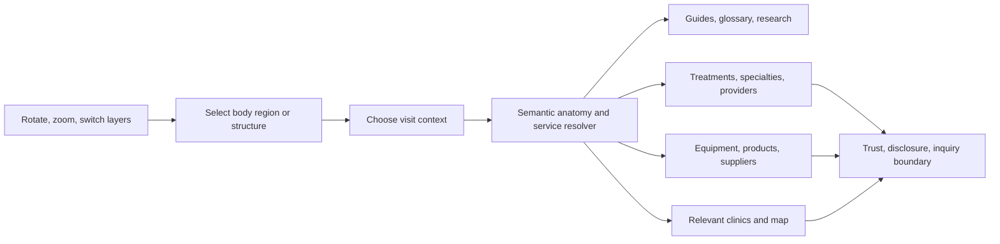

# Hea-lth 3D Human Discovery Engine v1

**Status:** Product and technical discovery. No 3D asset has been purchased, downloaded for production, embedded, or published.

Visual interaction blueprint: [`../design-lab/hea-lth-3d-human-discovery-vertical-slice-v1.svg`](../design-lab/hea-lth-3d-human-discovery-vertical-slice-v1.svg). It intentionally shows a conceptual wireframe, not a replacement for the licensed, clinically reviewed model required for production.

## 1. Product decision

Build the 3D Human as a reusable Hea-lth product layer, not as a decorative hero animation.

The experience must let a visitor rotate, zoom, and inspect a high-fidelity human model, select a visible body region or internal structure, choose the purpose of their visit, and receive a connected discovery experience for relevant treatments, specialties, doctors, clinics, hospitals, equipment, suppliers, guides, and locations.

The 3D viewer is an entry point into the portal. It does not diagnose, decide on surgery, recommend a provider without governed data, or imply a clinical outcome.

## 2. Confirmed external benchmarks

| Reference | Confirmed capability | Hea-lth implication |
| --- | --- | --- |
| [BioDigital Human](https://www.biodigital.com/product/the-biodigital-human) | Interactive anatomy, conditions, treatments, tours, authoring, web/mobile/AR/VR support, and a large library of individually selectable structures | The interaction model is viable at serious scale. Hea-lth needs the same separation between anatomy, conditions, treatment visualizations, and guided experiences. |
| [BioDigital developer tools](https://developer.biodigital.com/) | Viewer and Content APIs designed for custom web, mobile, and other integrations | A fast licensed proof can be built without reinventing medical anatomy. It would create a vendor dependency and requires commercial, privacy, availability, and exit-term review. |
| [Healthline and BioDigital integration](https://www.biodigital.com/p/healthline-customer-showcase) | BioDigital describes a branded BodyMap-style integration with structure-specific 3D experiences, deep links into evidence-based content, and more than 1,000 URLs | This is the closest product precedent for Hea-lth. The 3D engine must be connected to governed URL, content, provider, and location entities, not isolated as a visual feature. |
| [Three.js glTF workflow](https://threejs.org/manual/en/loading-3d-models.html) | glTF/GLB is a recommended runtime format; it carries scenes, meshes, materials, textures, skins, animations, and cameras | Custom Hea-lth models should ship as validated GLB assets, not raw OBJ, FBX, Blender, or Maya files. |
| [Three.js GLTFLoader](https://threejs.org/docs/pages/GLTFLoader.html) | Supports Draco, Meshopt, KTX2/Basis, animation, materials, and other glTF extensions | The custom viewer can load high-quality assets with a production compression pipeline. |
| [Three.js raycasting](https://threejs.org/docs/pages/Ray.html) | Raycasting supports pointer picking against 3D objects | A click on a named mesh such as `nose.external` can reliably resolve to a semantic body structure. |
| [Three.js clipping](https://threejs.org/docs/pages/WebGLRenderer.html) | WebGL renderer supports global and local clipping planes | Exploratory cross-section views are feasible, but medically meaningful cut surfaces must be pre-authored or created with robust geometry processing. A raw clip alone does not make a truthful anatomical section. |
| [Khronos glTF and KTX2](https://www.khronos.org/gltf/) | glTF and KTX2/Basis support compact runtime delivery and lower GPU texture memory use | The visual target is high fidelity without forcing a single oversized asset on every visitor. |
| [Mapbox geocoding](https://docs.mapbox.com/help/getting-started/geocoding/) | Forward/reverse geocoding, language options, GeoJSON results, search prioritization, and paid usage | The map can react to the selected anatomy topic and provider filters. We must choose a map provider and storage policy before implementation. |

## 3. Asset-source conclusion

The provided marketplaces are useful for discovery, but they are not automatically suitable for production medical use.

| Source | Current observation | Production decision |
| --- | --- | --- |
| [Free3D human catalog](https://free3d.com/3d-models/human) | The catalog contains a mixed set of human, organ, anatomical, game, and generic character files in multiple formats. The listing page does not prove a single commercial medical-use license for the category. | Do not use any model until the exact asset page, creator, license, permitted web delivery, derivative use, medical accuracy, and attribution requirements are reviewed. |
| [Sketchfab human catalog](https://sketchfab.com/tags/human) | The catalog is broad, but asset licenses vary. Sketchfab distinguishes editorial and standard licenses and restricts making an asset available as a stand-alone downloadable file. | Do not use an editorial asset. A standard asset still requires legal review for browser delivery, because GLB files can be accessible through a web client. Prefer a purpose-built web license or a vendor embed/API with explicit rights. |
| [Humano3D collection](https://humano3d.com/collections-3d-people/) | The page was protected by a browser verification screen during research, so its commercial terms and downloadable deliverables are unverified. | No asset evaluation or use until the exact product license, asset files, ownership, and web rights are reviewed. |
| [Zygote Male and Female Anatomy Collection](https://www.zygote.com/poly-models/3d-human-collections/3d-male-female-anatomy-collection) | The vendor lists 9,899,940 triangles, UV coordinates, textures, and hierarchical grouping. It describes a CT-based skeletal foundation, medical-professional consultation, named geometry, and photo-real colour and bump-map options. Its public help page says a real-time software licence can permit end-user software distribution, subject to commercial terms, royalties or subscription fees, and reasonable anti-extraction protection. | Top candidate for the owned, ultra-realistic source route. No asset may be downloaded, converted, or published until an executed real-time web licence grants the exact delivery, derivative, territory, language, security, and exit rights Hea-lth needs. |
| [BioDigital Human](https://www.biodigital.com/product/the-biodigital-human) | A mature interactive anatomy platform claims large anatomy, condition, treatment, and authoring coverage. | The fastest serious proof candidate. Do not adopt it without a business contract that addresses availability, data, branding, language, pricing, legal ownership, and exit strategy. |
| [Primal Pictures / Anatomy.tv](https://primalpictures.com/) | A clinically oriented anatomy platform says its interactive 3D models are reconstructed from real scan data and reviewed by anatomy experts. It offers web-based interactive content and says some content can be embedded. | A second medical-grade vendor to evaluate. We need explicit public commercial embedding, localization, customization, data, pricing, and exit rights before any use. |
| [Visible Body](https://www.visiblebody.com/legal/visible-body-user-agreement) | Its public agreement grants limited educational use and prohibits commercial or derivative use without express written consent. | Not a production source under standard public terms. Only evaluate if a separate enterprise agreement grants the exact rights Hea-lth needs. |
| Commissioned medical asset package | Not yet sourced | The preferred long-term ownership path if Hea-lth needs a branded, deeply integrated, independently hosted experience. It requires qualified 3D artists, a medically reviewed reference pack, license assignment, and delivery acceptance tests. |

**Non-negotiable rule:** a free or cheap human mesh is not a medically accurate product, and a high triangle count is not proof of clinical quality.

### 3.1 Ultra-realistic acceptance gate

The public experience must be ultra-realistic in the sense that matters to visitors and medical reviewers. It must not be a generic game avatar, a low-detail mannequin, a synthetic AI image, or a single fused model that only looks detailed from one angle.

An accepted source asset must pass every gate below before it can enter a Hea-lth prototype:

| Gate | Required proof |
| --- | --- |
| Human form | A full 360-degree adult body with credible body proportions, high-resolution regional detail, and no visible shortcuts in the face, hands, feet, skin, or silhouette during front, side, rear, and close views. |
| Clinical anatomy | Separately named and aligned exterior, skeletal, muscular, vascular, nervous, respiratory, digestive, urinary, reproductive, and organ structures. A qualified medical reviewer must approve the intended public use. |
| Material realism | Source-controlled PBR materials with documented texture rights. The vendor must demonstrate realistic skin, tissue, bone, organ, and vessel rendering under the planned lighting. No generated texture is accepted as clinical evidence. |
| Detail where it matters | The full-body source may contain millions of triangles. When a visitor selects a region such as the nose, the engine must stream a dedicated high-detail regional asset or authored LOD, rather than merely zooming into an under-detailed whole-body mesh. |
| Internal and section fidelity | Internal layers must be authored as proper anatomical structures. Cross-sections must use medically reviewed cut geometry or a vendor-provided sectional model. Runtime clipping alone is insufficient. |
| Semantic structure | Each selectable mesh must map to a stable anatomy ID and hierarchy. The vendor must provide an inspectable naming map, not just a visually impressive render. |
| Web rights and protection | A signed licence must permit the exact browser or embedded delivery model. It must define territory, Hebrew localization, derivatives, updates, commercial display, anti-extraction measures, and end-of-contract treatment. |
| Measured delivery | The source asset is preserved at its required fidelity, while the web viewer streams audited LODs, textures, and systems by intent. Acceptance requires desktop and mobile performance evidence, not a promise. |

The Zygote collection is the current reference class, not an approved purchase. Its listed 9,899,940 triangles prove that the requested source fidelity exists. The final selection will be based on visual review, medical review, real-time web rights, integration feasibility, and measured delivery, not a triangle count alone.

## 4. Experience model



### Example: selecting the nose

1. The viewer highlights the external nose and opens a neutral discovery panel.
2. The visitor chooses a context such as aesthetic change, nasal breathing, injury/reconstruction, dermatology/skin, or medical equipment.
3. The resolver returns only governed relationships. For example, functional breathing routes can surface ENT and rhinology education, while aesthetic routes can surface plastic-surgery education and provider profiles.
4. A treatment list, guide rail, professional directory, and map update to that selected context.
5. A visitor can save, compare, or start an inquiry only after those future systems have real consent, ownership, and routing.

The model may show anatomy and educational structure. It must never turn a click into a diagnosis or make a surgery recommendation.

## 5. Interaction modes

| Mode | User purpose | Required design and safety behavior |
| --- | --- | --- |
| Exterior | Choose a visible body region such as nose, eyes, breast, abdomen, knee, scalp, or skin | Large accessible hit targets, neutral labels, keyboard path, mobile fallback list |
| Systems | Switch between skeletal, muscular, vascular, respiratory, digestive, nervous, skin, and organ systems | Layer legend, no sensory overload, clinically reviewed names |
| Internal | Fade or isolate layers to view organs and structures | Explicit layer controls and reset action. Do not obscure the visitor's orientation. |
| Cross-section | Inspect a predefined cut or a controlled clipping view | Pre-authored cut surfaces for clinical fidelity. Raw clipping is an exploratory tool, not a final medical illustration. |
| Procedure | See an educational procedure or treatment pathway | Separate education from marketing. Medical review, source, date, risk context, and no promised outcome. |
| Discover | Resolve a chosen anatomy context into treatments, professionals, equipment, and guides | Results have source, verification, disclosure, and empty-state rules. |
| Map | See relevant places and available categories around a selected location | Provider/location data drives the map. Anatomy selection only supplies the topic filter. |

## 6. Engine architecture

### 6.1 Reusable viewer package

The future `hea-lth-human-engine` is a separate package or plugin-owned front-end bundle. It is not a page-builder widget and should not be embedded as arbitrary page HTML.

| Module | Responsibility |
| --- | --- |
| Viewer shell | WebGL canvas, responsive sizing, camera/orbit controls, keyboard controls, loading state, error fallback |
| Model registry | Registers models, layer files, LOD variants, licenses, version, clinical reviewer, supported devices, and language labels |
| Anatomy graph | Maps mesh IDs to stable anatomy and body-region IDs, synonyms, parent-child relationships, and systems |
| Hotspot resolver | Resolves a body structure plus visitor context into governed entity IDs and UI panels |
| Content resolver | Retrieves treatments, specialties, providers, clinics, hospitals, guides, equipment, suppliers, and locations |
| Map bridge | Applies the anatomy context as a filter to the provider/location map and handles map result selection |
| Safety layer | Applies medical-disclaimer, emergency, age, consent, and no-diagnosis rules |
| Analytics layer | Records anonymous interactions and task success. It must not record sensitive health data without a privacy-approved purpose. |
| Asset pipeline | Validates GLB files, creates LODs, compresses geometry and textures, uploads immutable versions, and monitors download/performance |

### 6.2 Model manifest pattern

The visual asset is not the source of truth. A versioned manifest makes the engine reusable for male, female, pediatric, facial, hand, dental, scalp, organ, treatment, and equipment models.

```json
{
  "modelId": "adult-human-v1",
  "version": "1.0.0",
  "license": {
    "owner": "TBD",
    "webDeliveryAllowed": false,
    "clinicalReview": "required"
  },
  "layers": [
    { "id": "skin", "meshIds": ["skin.outer"], "kind": "surface" },
    { "id": "skeletal", "meshIds": ["skeleton.*"], "kind": "system" },
    { "id": "respiratory", "meshIds": ["respiratory.*"], "kind": "system" }
  ],
  "hotspots": [
    {
      "id": "nose.external",
      "meshId": "face.nose.external",
      "anatomyId": "anatomy:nose",
      "contexts": ["aesthetic", "breathing", "injury", "skin", "equipment"]
    }
  ]
}
```

### 6.3 Content resolver pattern

```text
anatomy:nose + context:breathing
  -> specialty:otolaryngology
  -> topic:nasal-obstruction
  -> treatment:functional-rhinoplasty
  -> guide:nasal-breathing-evaluation
  -> provider-filter:ENT/rhinology
  -> clinic-filter:relevant service
  -> equipment-filter:only regulated, catalogued items
  -> map-filter:provider location + visitor location
```

Every relationship needs an owner, evidence level, public label, update date, and medical-review status. No relationship is created because it has commercial value alone.

## 7. 3D quality and delivery standard

### Source quality

- Use clinically reviewed source material and a written asset license. The source must identify whether it is educational, generic, cosmetic, or medically validated.
- Require an ultra-realistic asset review at full body and regional close-up scale. The review must include frontal, profile, rear, oblique, and high-zoom views for skin, face, hands, feet, major joints, and the first commercial regions such as nose, scalp, breast, abdomen, knee, and skin.
- Require separately named meshes and stable anatomy IDs. A single fused human mesh cannot support reliable click targets, layer isolation, or semantic mapping.
- Require clean topology, UVs, PBR materials, documented texture rights, correct scale, and original source files in addition to delivery GLBs.
- Require an asset-specific proof set before acceptance: scene hierarchy export, mesh and texture inventory, source and runtime triangle counts, material preview, anatomy naming sample, clinical-review record, licence excerpt, browser-delivery controls, and performance test plan.
- Require adult male and adult female representation only after clinical, cultural, accessibility, and visual direction approval. A future pediatric model is a separate safety and legal workstream.
- Require full version history and a reviewer for every model update.

### Runtime quality

- The source model may be far above 100,000 triangles. For example, Zygote lists 9,899,940 triangles for its complete male and female collection. Runtime fidelity will use measured multi-LOD delivery, not a single triangle-count target.
- The viewer must preserve the perception of premium realism by loading the whole body first, then streaming high-detail regional assets and internal systems on selection. The visual target is a museum-quality clinical showroom, not a compressed all-in-one model.
- Ship GLB/glTF for web delivery. Use geometry compression and KTX2/Basis texture compression where tests demonstrate a benefit. Three.js supports the related GLTFLoader pipeline, and Khronos positions KTX2/Basis as a compact GPU-friendly texture path.
- Split heavy systems into on-demand chunks. The visitor should not download detailed organs, procedures, and high-resolution textures before selecting a relevant path.
- Test actual target devices, 4G network behavior, memory use, input latency, GPU capability, and WebGL fallback before setting performance budgets.
- Provide a complete accessible non-3D alternative: searchable body-region index, treatment/category navigation, and text equivalents for every public function.

### Local production toolchain

The local workspace is ready to inspect a real delivery asset when licensing is approved:

- **Blender 5.1.2** is available for source-file inspection, scene/layer review, material checks, GLB export, and visual QA.
- **glTF Transform CLI 4.4.1** is available for `inspect`, `validate`, geometry optimization, texture compression, simplification, and deterministic GLB packaging.
- No tool changes the licensing requirement. A technically valid GLB is not automatically a legally deliverable or medically appropriate asset.

## 8. Data model needed before the map can work

| Entity | Essential public fields |
| --- | --- |
| Body region / anatomy structure | Stable ID, Hebrew/English names, synonyms, system, layer, description, clinical reviewer, last-reviewed date |
| Medical topic | Title, medical sources, risk wording, reviewer, update date, emergency boundary |
| Treatment / procedure | Purpose, candidate questions, risks, recovery context, source, reviewer, last-reviewed date |
| Specialty | Name, related body structures/topics, credential source, directory rules |
| Professional | Name, specialty, license/credential source, clinic, city, languages, accessibility, last-verified date, disclosure state |
| Clinic / hospital | Services, location, accessibility, language, contact method, verification, map geometry |
| Equipment / product | Regulated-product classification, seller, source, availability, consumer/professional audience, safety and returns data |
| Supplier | Company, categories, service area, verification, commercial disclosure, product relationships |
| Location | Address, coordinates, source, geocoding storage terms, area/category filters |

## 9. Map behavior

Selecting an anatomy context does not move a map randomly. It applies a topic and context filter to an already governed result set:

```text
selected anatomy + intent + specialty/treatment filters + visitor location + verification rules
  -> matching provider/clinic/equipment result set
  -> clustered map markers
  -> list-map synchronization
  -> selected result detail
```

Mapbox and Google Maps both support location search and marker clustering, but their commercial terms, usage cost, storage constraints, Israel coverage, language behavior, and data-processing terms must be compared before a vendor is selected. Mapbox distinguishes temporary and permanent geocoding use, so addresses and coordinates need an explicit data-retention decision.

## 10. Build path

| Phase | Deliverable | Gate |
| --- | --- | --- |
| 0. Asset and vendor due diligence | License scorecard for BioDigital, commissioned 3D studios, Sketchfab, Free3D, and Humano3D candidates | Legal, IP, medical, web-delivery, and exit rights pass |
| 1. Technical spike | Non-public viewer with a licensed or owned sample model, orbit, click selection, layer switch, and no data claims | Desktop/mobile WebGL, performance, accessibility fallback, and security test pass |
| 2. Nose vertical slice | One anatomy node resolves to educational topics, treatments, specialties, placeholder-free provider data, and a synchronized map | Clinical review, source dates, data governance, and user-task test pass |
| 3. Component system | Reusable viewer, result drawer, map bridge, loader, fallback, and analytics controls | Token use, RTL, mobile, accessibility, and privacy review pass |
| 4. Model registry | Versioned manifest pipeline for additional regions, organ systems, and future equipment models | Asset acceptance, review ownership, and regression tests pass |
| 5. Production expansion | New body systems, treatment visualizations, and governed commercial inventory | Each expansion has content, clinical, legal, and performance approval |

## 11. What we do not do

- Do not buy the first visually impressive model from a marketplace.
- Do not use an anatomy asset with unknown medical accuracy or uncertain web license.
- Do not expose a raw GLB file under a license that forbids stand-alone asset access.
- Do not let a click on an organ become a medical recommendation, symptom diagnosis, or guaranteed treatment outcome.
- Do not make 3D mandatory for access to medical content, provider discovery, or map results.
- Do not load a huge full-body, every-organ asset on the homepage just to show technical ambition.
- Do not port a NadLan showroom directly into healthcare. Its camera and interaction patterns may be reusable, but the medical model, data resolver, trust, and safety layers are new work.

## 12. NadLan engine access

The existing NadLan showroom can accelerate the viewer shell only if it contains reusable, licensed source code. It cannot prove medical accuracy or solve the anatomy/content resolver.

When the build phase begins, the exact access needed is a GitHub repository URL plus permission for the Hea-lth GitHub account or this Codex session to read the relevant branch. I will then inventory the code, licenses, rendering dependencies, camera/input patterns, asset pipeline, and extraction risks before deciding what can safely be adapted.

## 13. Immediate next actions

1. Create an asset and license scorecard for the named sources and two medical-grade vendors.
2. Compare BioDigital license/embedding terms against a commissioned-asset ownership route.
3. Define the Nose vertical slice in the Hea-lth information architecture and data governance model.
4. Produce a 3D discovery screen in the design system, including exterior, internal, result drawer, map, and accessible fallback states.
5. Only after the asset and licensing gate, build the non-public technical spike.
