# Hea-lth commercial operating model and lead-routing v1

## Status and decision posture

This is a **structural business case**, not a finance-ready forecast. The product direction is clear, but there are no approved traffic baseline, provider interview findings, unit prices, conversion data, supplier agreements, or CRM records from which to calculate credible revenue.

The operating model is designed to earn revenue without turning medical information, rankings, or editorial content into an opaque pay-to-play system.

## Customer groups and value proposition

| Customer group | Job to be done | Value Hea-lth can earn from | Boundary |
| --- | --- | --- | --- |
| Visitors | Understand a topic and choose a next practical step | Trust, repeat use, qualified consented inquiry | No diagnosis, no promised outcome, no hidden commercial ranking |
| Verified professionals and clinics | Be found in the right treatment or anatomy context | Subscription, qualified inquiry, clearly labeled sponsorship | Verification and eligibility cannot be bought |
| Hospitals and premium-care organizations | Explain services and manage accurate discovery paths | Enterprise presence, approved service pathways, governed referral operations | No clinical claim without review and source |
| Equipment manufacturers and suppliers | Reach a qualified professional or consumer audience with approved catalog information | Supplier presence, B2B inquiry, referral or commerce fee when permitted | Only after product, availability, advertising, and regulated-product review |
| Editorial and research partners | Reach a relevant audience with useful, clearly labeled education | Sponsorship with strict independence and disclosure | Sponsor cannot control medical conclusion, ranking, or reviewer |

## Monetization architecture

| Revenue lane | Buyer pays for | What the visitor sees | Release gate |
| --- | --- | --- | --- |
| Verified presence | Structured verified profile, service taxonomy, office details, availability-managed contact path | Verification badge, factual profile, disclosure | Credential and factual verification policy |
| Sponsored placement | Clearly marked additional placement in a qualifying category | "ממומן" or equivalent visible disclosure, no false "best" claim | Published sponsorship policy and audit trail |
| Qualified inquiry | A consented contact request that passes duplicate, fraud, routing, and eligibility checks | Choice of recipient and clear handoff consent | Lead quality definition, CRM routing, refund or credit rules |
| Supplier or equipment lead | A catalog or procurement inquiry associated with an approved category | Product and seller disclosure, not a treatment promise | Regulated-product, stock, pricing, returns, and advertising review |
| Enterprise service path | A governed destination for a hospital, clinic group, or premium provider network | Clearly owned care or information path | Contract, data ownership, clinical review, and measurement plan |
| Editorial sponsorship | Sponsorship of an independently reviewed educational format | Prominent sponsorship label and editorial ownership | Medical, legal, and editorial approval |

The first revenue sequence should be **verified presence plus qualified inquiry**, because it creates a durable professional supply base before adding marketplace complexity. Sponsored placement, catalog referrals, and enterprise service paths should be introduced only after the verification and disclosure system is operational.

## What is never sold

1. A medical diagnosis, treatment recommendation, emergency triage decision, or clinical outcome.
2. A fabricated ranking, profile, review, availability slot, or patient testimonial.
3. Access to raw medical information, uploaded documents, symptoms, or browsing histories.
4. A right to override clinical review, editorial review, verification, or public disclosure.

## Lead-routing design

```mermaid
flowchart LR
    A["Guide, treatment, provider, anatomy, or equipment path"] --> B["Visitor selects a non-clinical discovery context"]
    B --> C["Minimal consented contact request"]
    C --> D["Fraud, duplicate, disclosure, and eligibility checks"]
    D --> E["CRM routing rules"]
    E --> F["Verified eligible recipient"]
    F --> G["Recipient response SLA and outcome status"]
    G --> H["Visitor confirmation and quality feedback"]
    H --> I["Revenue, credit, and quality reporting"]
```



### Minimum form fields for the first launch

- Full name, phone or email, selected public topic, selected city or service area, preferred contact channel, and contact-time preference.
- Separate consent for the handoff to a named provider or named category of providers.
- Separate optional marketing consent. It must not be bundled with the service request.
- No symptom narratives, diagnosis prompts, medical files, test results, insurance identifiers, or free-text clinical history in the portal form.

The CRM receives a lead ID and consent record. The public site should retain the minimum operational audit information needed for consent, routing, and abuse prevention, then apply an approved retention schedule. A provider receives only the information required to respond to the specific request.

### Routing rules in order

1. Recipient is published, verified, contractually active, and not suspended.
2. Recipient matches the selected specialty, service, body-region context, and geography.
3. Recipient has declared capacity and accepts the requested contact channel.
4. Sponsored eligibility is considered only after the above relevance and verification checks, with disclosure preserved.
5. If no qualified recipient is available, show a truthful next step such as a guide, directory search, or request queue. Do not silently reroute to an unrelated payer.

### Quality and fraud controls

- Server-side rate limiting, bot mitigation, device and duplicate checks, plus a tamper-resistant consent timestamp.
- No automatic forwarding of raw free-text medical data.
- Provider response-time and disposition tracking, with reasons for uncontactable or invalid requests.
- Dispute, suppression, and refund or credit workflow before charging per inquiry.
- Event-level audit log separating editorial, verification, commercial, and routing decisions.

## CRM and data boundary

Hea-lth needs a CRM connector only after the following ownership decisions are recorded: controller or processor roles, recipients, consent text, regional data storage, access controls, retention, breach process, and export or exit rights. The selected CRM can be HubSpot, Monday, Salesforce, or another approved system, but the public website must not send data until the integration contract, consent language, and routing SLA are accepted.

## Implemented internal route-health audit, 2026-07-11

The source now includes a restricted WordPress admin screen below the internal
`hp_lead_route` record type. It is a configuration audit, not an intake form,
CRM dashboard, billing console, or public report.

It checks only the non-PII prerequisites for a future handoff:

1. Route record is published and active.
2. Recipient is an existing published and verified provider or clinic.
3. Recipient has explicitly declared capacity to accept inquiries.
4. The route identifies a consent version and has a current review date.
5. A disclosed-sponsored route identifies a commercial-disclosure version.

The report returns `ready`, `needs_review`, or `blocked`. It never renders or
accepts visitor contact data, medical information, lead contents, routing
priority, or CRM identifiers. Its behavior test uses only synthetic route and
provider state.

WordPress requires capability checks both when adding an admin submenu and in
the rendering callback. The audit therefore uses `admin_menu`, a custom-post
type submenu parent, and `manage_options` checks in both places. [WordPress
`add_submenu_page` reference](https://developer.wordpress.org/reference/functions/add_submenu_page/)

**Evidence:**

- `plugin-src/hea-lth-platform-core/includes/class-hea-lth-lead-route-resolver.php`
- `tooling/tests/lead-routing-audit-behavior-test.php`
- `tooling/tests/lead-route-resolver-contract-test.php`

This is not an authorization to send a lead. The CRM, consent text, lawful
retention policy, anti-fraud controls, recipient contracts, disclosure policy,
SLA ownership, and release review remain mandatory.

## Measurement model

| Metric | Formula | Why it matters | Status |
| --- | --- | --- | --- |
| Qualified inquiry rate | qualified inquiries / eligible sessions | Indicates whether information paths produce useful demand | Missing baseline |
| Consent completion | explicit handoff consents / form starts | Detects friction and consent clarity | Missing baseline |
| Match rate | routed inquiries / qualified inquiries | Shows whether provider supply matches demand | Missing verified supply data |
| First response SLA | inquiries answered within target / routed inquiries | Protects visitor experience and commercial value | Target to approve |
| Contacted rate | confirmed contacts / routed inquiries | Distinguishes lead delivery from lead value | Needs provider feedback loop |
| Credit rate | credits / billed inquiries | Detects fraud, poor fit, or routing defects | Needs billing rules |
| Provider retention | active verified accounts retained / starting active accounts | Tests recurring value | Missing cohort data |
| Revenue per eligible session | net revenue / eligible sessions | Unifies subscription, placement, and lead economics | Structural only |

### Structural value model

```text
qualified inquiries = eligible sessions x intent completion x valid consent x quality pass
net inquiry revenue = qualified inquiries x accepted lead price - credits - routing and acquisition costs
recurring provider revenue = active verified providers x contracted recurring fee
net portal revenue = recurring provider revenue + net inquiry revenue + disclosed sponsorship + approved supplier revenue
```

No price, conversion, or ROI number should be presented as a forecast until it is grounded in live pilot evidence.

## Initial pilot

Start with one narrow, commercially meaningful vertical such as nose and breathing, hair and scalp, or a selected premium aesthetics path. A pilot needs:

1. A published definition of verified provider eligibility.
2. At least one real, reviewed information path and one relevant anatomy resolver path.
3. A small supply group with written routing and response commitments.
4. Consent-first request form, CRM queue, response SLA, quality outcomes, and no-show or credit policy.
5. Weekly review of relevance, response speed, invalid requests, visitor satisfaction, and commercial outcomes.

## Regulatory and trust constraints to verify with counsel

- The Ministry of Health's advisory committee addresses misleading health advertising, including advertising by physicians, health professionals, treatments, health products, and medical products. This makes a written substantiation, review, and disclosure workflow necessary before commercial launch. [Ministry of Health committee](https://www.gov.il/he/departments/Units/committee-deception)
- Advertising a medical preparation requires Ministry of Health approval under the stated process, and the service page says approvals are issued only for OTC preparations. Product and pharmaceutical advertising cannot be treated as ordinary marketplace inventory. [Ministry of Health pharmaceutical advertising service](https://www.gov.il/he/service/pharmaceutical-advertising-regulations)
- The Privacy Protection Authority's current service page describes changed registration duties after Amendment 13 and identifies special database categories. Health information requires its own legal and security analysis. [Privacy Protection Authority registration guidance](https://www.gov.il/he/service/registration_in_the_database)
- The official medical-device registry cautions that its listing is incomplete. It can inform verification work, but cannot by itself prove a product's full commercial or clinical status. [Medical-device registry](https://registries.health.gov.il/MedicalDevices)

This document is a product and operating proposal, not legal advice. Before public data collection, advertising, or billing, obtain Israeli legal, privacy, clinical, and consumer-protection review.

## Decisions required before a finance-ready business plan

1. Pilot vertical and target geography.
2. Provider eligibility, verification source, and re-verification cadence.
3. Monetization sequence and what counts as a billable qualified inquiry.
4. CRM owner, data processor review, recipient consent text, and response SLA.
5. Editorial and sponsored-content separation policy.
6. Traffic baseline, provider acquisition cost, expected supply, and pricing inputs.
