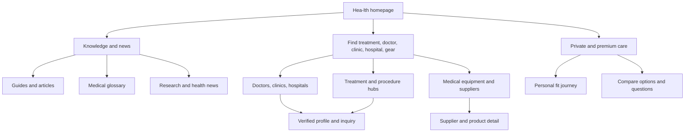

# Hea-lth Design Reset and Portal Blueprint v2

**Status:** Evidence-gated design work. This is not a WordPress build approval and no production change is authorized by this document.

**Decision:** Discard the rejected local concept as a visual direction. Preserve only the existing URL skeleton and SEO equity under a separate migration plan. The new public experience will be designed as a premium Israeli health decision platform with a genuinely large portal homepage, not a small lead-generation landing page.

## 1. Evidence reviewed

| Source | What was inspected | What it proves |
| --- | --- | --- |
| `Hea-lth.co.il - Design Exploration 01.pdf` | All rendered pages | An editorial forest, pale mineral mint, ivory, and restrained bronze direction already exists. It is a useful starting language, not a complete product design. |
| High-resolution TIFF panels `0001`, `0002`, `0003` | Homepage, private-concierge direction, editorial-card direction | The exploration is visually stronger than the rejected prototype and can support a mature art direction. It still lacks the required identity system, semantic tokens, real data rules, mega menus, and full template coverage. |
| Figma file `0oFClx3r3ewraptoogYhis` | Existing page `01 - Design Directions`; visible directions include Clinical Journal, Private Concierge, and Future Medicine | The source file is available in Chrome and must remain the design source of truth. Automated Figma extraction and write-back are currently rate-limited on the Starter plan. |
| Lovable project `03385b93-40b2-4758-bab3-c90969c43084` | Read-only code and styles | It provides generic semantic-token mechanics, not a Hea-lth identity. It will not build or host Hea-lth. |
| Lovable project `a7493b94-2e46-4d38-9c6a-80dcf0905f45` | Read-only token and premium system examples | It is a NadLan reference. We can reuse the discipline of tokens, grids, states, and design documentation, but never copy its real-estate palette, copy, logo, or component surface. |
| Clalit live homepage, observed 2026-07-10 | Chrome desktop capture and page structure | Clalit proves the local expectation for a broad health portal: personal service access, editorial rails, digital products, calculators, partner brands, and a deep service footer. |
| Zocdoc and RealSelf public pages, observed 2026-07-10 | Official public product pages | They establish relevant global patterns for search, provider discovery, verified credentials, real reviews, availability, procedure facts, and confidence-building decision paths. |

## 2. What we retain and what we reject

### Retain from the supplied exploration

- The editorial contrast between a dark clinical green and soft mineral surfaces.
- Strong Hebrew display typography paired with a quiet operational sans.
- Restrained bronze as a signal for premium editorial detail, not a decorative theme.
- Large, confident surfaces that give complex medical decisions room to breathe.
- The split between a broad health-information layer and a high-touch private-medicine layer.

### Reject or redesign before any build

- The current wordmark is not a brand identity system. It needs a professional identity round, not another generic cross, plus sign, or generated symbol.
- The supplied panels contain unverified counts, ratings, profiles, and promises. None may appear publicly until each field has a source, owner, verification cadence, and disclosure rule.
- The current frames cover only the beginning of a homepage. They do not yet solve a large content portal, a mega menu, search, filters, provider profiles, suppliers, account flows, professional flows, or editorial templates.
- No one-off colors, fonts, spacing, radii, shadows, or button treatments. Every screen must use the shared token system below.
- No WordPress template, old page, old theme, or legacy visual layer will be patched into the new visual system.

## 3. Candidate token foundation

The palette below is extracted from the supplied TIFF panels using color quantization. It is a candidate foundation, not final brand approval. Contrast was verified against the main pale surface on 2026-07-10.

Machine-readable candidate tokens: [`../design-lab/hea-lth.design-tokens.v0.json`](../design-lab/hea-lth.design-tokens.v0.json). Visual system and portal map: [`../design-lab/hea-lth-design-system-and-home-blueprint-v2.svg`](../design-lab/hea-lth-design-system-and-home-blueprint-v2.svg).

| Token | Candidate value | Intended role | Contrast proof |
| --- | --- | --- | --- |
| `color/forest/950` | `#0A2320` | Dark hero, footer, highest-contrast heading | 15.43:1 on `mint/50` |
| `color/forest/800` | `#143F35` | Primary action, dense navigation, dark cards | 10.97:1 on `mint/50` |
| `color/forest/700` | `#235A51` | Secondary action and interactive state | Reviewed in component tests |
| `color/mint/50` | `#F2F9F6` | Clinical editorial surface | Base pale surface |
| `color/ivory/50` | `#F9F7EE` | Private-medicine editorial surface | 15.36:1 with `forest/950` |
| `color/text/secondary` | `#4F6360` | Readable metadata and supporting copy | 5.98:1 on `mint/50` |
| `color/bronze/600` | `#9E752B` | Rule, icon detail, non-text emphasis only | 3.91:1 on `mint/50`, not approved for small text |
| `color/bronze/500` | `#BB8937` | Hover and data accent | Not used for body copy |
| `space/*` | 4, 8, 12, 16, 24, 32, 40, 48, 64, 80, 96, 128, 160px | Eight-point spatial scale | Shared across every layout |
| `radius/*` | 0, 4, 8, 16, pill | Functional hierarchy, not decoration | Applied by component role only |
| `motion/*` | 120, 220, 360ms | Focus, hover, disclosure, and drawer feedback | Must honor reduced motion |

### Typography decision gate

No font is final yet. The next review will compare three actual Hebrew pairings in the same hero, navigation, article, table, and mobile screen. The test must include real Hebrew punctuation, Latin medical terms, numerals, long treatment labels, and RTL form inputs. The winning system will have licensed or openly licensed files, self-hosted web fonts, `font-display: swap`, and defined text roles.

The likely visual structure is a restrained Hebrew editorial serif for display headings plus a contemporary Hebrew sans for interfaces and long reading. It is not permission to reuse a fashionable serif everywhere. Dense menus, forms, filters, provider data, and medical tables require a clear sans system.

### Identity decision gate

The identity work will produce three vector-led directions with Hebrew and English lockups, favicon, social avatar, monochrome version, small-size test, clear-space rules, favicon test, and accessibility contrast proof. We will not use a generic AI-generated icon or a copied medical symbol. A final logo is not approved until it survives a 16px favicon, a mobile header, an embossed-looking print use, a single-color use, and a provider-profile context.

## 4. The public product model

Hea-lth is not a health-insurer portal and not a thin directory. The product has three public layers that connect cleanly:

1. **Trusted knowledge:** guides, glossary, news, research explainers, conditions, treatments, prices, and recovery education.
2. **Decision and discovery:** treatment comparison, specialist and clinic discovery, locations, technology and equipment discovery, save and compare behavior, and request-for-fit journeys.
3. **Premium action:** private medicine, aesthetic medicine, plastic surgery, hair restoration, advanced diagnostics, longevity, selected devices, and verified professional connections.

The third layer is commercially important, but that commercial structure remains private. The public experience speaks about clarity, quality, verification, and finding the right option. It never exposes internal terms such as leads, routing, commissions, paid placement, or CRM.

## 5. Homepage anatomy: a large portal by design

The homepage will be long because it has real jobs to perform. It will not be a wall of repeated cards or an SEO keyword dump. Each rail must have a distinct user decision, data source, editorial owner, and destination template.

| Order | Module | Public job | Data or editorial requirement |
| --- | --- | --- | --- |
| 1 | Utility and trust strip | Languages, accessibility, important service boundary | Real links only |
| 2 | Global header and mega menu | Direct people to the primary health worlds | Governed taxonomy and active menu data |
| 3 | Search-led hero | Start with a treatment, symptom, specialty, doctor, clinic, or technology | Search index and safe no-result behavior |
| 4 | Six immediate routes | Aesthetic medicine, plastic surgery, hair and skin, private medicine, advanced diagnostics, equipment and technology | Category hubs, not dead cards |
| 5 | "How to decide" route | Help a visitor move from uncertainty to a structured next step | Medical-review and escalation boundary |
| 6 | Premium treatment collections | Surface high-value treatment clusters without fake urgency | Keyword-to-URL map and editorial ownership |
| 7 | Find a professional | Search doctors, clinics, hospitals, and specialties | Credential source, last-verified date, disclosure policy |
| 8 | Find a place | City, region, hospital, clinic, accessibility, language, and travel context | Location entity model and map data |
| 9 | Compare options | Compare treatment routes, questions to ask, recovery, price context, and evidence level | Comparison schema, source dates, reviewer ownership |
| 10 | Guides and research | Publish major guides, explainers, research updates, and clinical commentary | Byline, reviewer, sources, update dates |
| 11 | Devices and suppliers | Discover relevant medical equipment, technology, and suppliers | Product/supplier data, regulation and disclosure rules |
| 12 | News and innovation | Curate clinical, technology, and wellness news | Editorial policy and publication workflow |
| 13 | Medical glossary | Make broad medical knowledge navigable and useful | Entity model and source standards |
| 14 | 3D Human Discovery Hub teaser | Offer a clearly labeled route to an advanced body, treatment, provider, and map discovery tool | Separate 3D asset, licensing, clinical-review, performance, and accessible-fallback gates. Do not load it as a heavy homepage decoration. |
| 15 | Personal workspace teaser | Saved comparisons, requests, and updates | Account authorization and privacy model |
| 16 | Professional and supplier route | Invite credible organizations to build verified presence | Separate professional experience and qualification policy |
| 17 | Trust-rich footer | About, editorial standards, reviewer policy, privacy, contact, and controlled directory paths | Legal pages and ownership |

## 6. Header and mega-menu architecture

The desktop header will carry six primary routes and one clear action. It will not attempt to expose the whole portal in a single row.

| Primary route | Mega-menu columns |
| --- | --- |
| Treatments and surgery | Popular treatments, procedures, recovery, comparison guides, find a specialist |
| Aesthetics, skin, and hair | Facial aesthetics, body aesthetics, dermatology, hair restoration, technology, trusted guides |
| Private medicine | Specialties, consultations, diagnostics, hospitals and clinics, travel and language support |
| Prevention and longevity | Executive screening, diagnostics, wellness, nutrition and movement, research explainers |
| Doctors, clinics, and hospitals | Find by specialty, treatment, city, hospital, clinic type, verified profiles |
| Equipment and medical technology | Devices, clinic equipment, consumer health gear, suppliers, buyer guides |

The global search sits in the header and hero. It must understand synonyms, Hebrew and English treatment terms, doctors, clinics, conditions, and locations. Account, saved items, and professional access are utility paths, not primary menu clutter.

## 7. Design artifact suite before WordPress

No theme work starts before these designs exist and pass review. Each screen gets desktop, tablet, and mobile states where appropriate.

1. Homepage with all sixteen content rails.
2. Full desktop mega menu and mobile navigation drawer.
3. Treatment hub and a flagship treatment detail page.
4. Guide or long-form medical article template.
5. Doctor directory with filters and no-results state.
6. Doctor profile, including credential, verification, and inquiry patterns.
7. Clinic or hospital profile.
8. City and location discovery page with map behavior.
9. Equipment and supplier index plus a controlled product/supplier detail screen.
10. Price and comparison tool shell with source and update language.
11. News and research index plus article template.
12. Medical glossary index and term template.
13. Saved-item and account entry screens.
14. Private-care request flow.
15. Professional/supplier onboarding and profile-management entry screens.
16. Footer, legal, editorial policy, and reviewer surface.
17. 3D Human Discovery Hub with exterior, systems, internal, result-drawer, map, and accessible non-3D states. See [`HEA_LTH_3D_HUMAN_DISCOVERY_ENGINE_V1_2026-07-10.md`](HEA_LTH_3D_HUMAN_DISCOVERY_ENGINE_V1_2026-07-10.md).

## 8. Benchmark decisions

| Reference | Confirmed strength | What Hea-lth must do differently | Proof target |
| --- | --- | --- | --- |
| Clalit | A broad local health destination with personal access, digital services, editorial content, calculators, partner brands, and deep navigation | Match the breadth of useful routes but make the information hierarchy calmer, premium, and decision-led for private medicine, aesthetics, and advanced care | Task-completion test for treatment, doctor, and clinic discovery; no homepage rail without a useful destination |
| Zocdoc | Search combines condition or procedure, provider, location, insurance, availability, reviews, and booking | Build an Israel-specific discovery layer with verified profile facts, clear source dates, fit criteria, and appropriate request paths before claiming availability | Profile completeness, verified-field rate, search success, inquiry quality |
| RealSelf | Procedure pages connect reviews, costs, verified providers, questions, before-and-after media, and provider trust rules | Build the trust model first: verified credentials, moderation, image consent, disclosures, balanced risks, and clear review policy. Do not imitate unsupported ratings or fabricated outcomes | Credential freshness, moderation evidence, source/review provenance, medical review signoff |
| Neko Health | A focused diagnostic journey with a distinct scan, clinician consultation, immediate results, action plan, and data-rich skin mapping | Use advanced interfaces only where a real service, data source, clinical owner, and action exist. Do not add decorative 3D or AI features to create the appearance of innovation | User task value, data provenance, clinical safety review, performance budget |
| Prenuvo | Premium diagnostics are presented as an integrated clinic, hardware, software, and patient experience rather than a generic technology feature | Each premium service should have its own clear journey, evidence standard, service boundary, and clinical explanation | Service-hub conversion quality, source freshness, reviewer approval |
| One Medical | A broad service portfolio remains usable by centering the member experience across in-person, virtual, records, scheduling, and messages | Treat the future personal area as a connected workspace, not an afterthought. No account capability is shown before it is actually operating and privacy reviewed | Safe account launch, task completion, consent and privacy checks |

Reference pages: [Clalit](https://www.clalit.co.il/he/Pages/default.aspx), [Zocdoc](https://www.zocdoc.com/), [RealSelf provider discovery](https://www.realself.com/find), [RealSelf procedure and trust model](https://www.realself.com/), [Neko Health](https://www.nekohealth.com/us/en), [Prenuvo](https://www.prenuvo.com/about), [One Medical](https://www.onemedical.com/about-us/).

## 9. Proposed USD 1,000,000 design investment model

This is a proposed allocation of work, not an expense already made and not authorization to spend money. It shows the standard of work implied by a world-class design target.

| Workstream | Proposed allocation | Tangible output | Acceptance proof |
| --- | ---: | --- | --- |
| Patient, professional, and supplier research | $100,000 | Interview evidence, journey maps, usability priorities | Recorded evidence and ranked decisions |
| Brand strategy and identity system | $120,000 | Three identity routes, final lockup, icon system, brand book | Small-size, monochrome, bilingual, and accessibility tests |
| Hebrew and English typography plus art direction | $75,000 | Licensed type system, photography direction, editorial art rules | Readability and performance review |
| Information architecture and content-model UX | $130,000 | Entity model, navigation, search taxonomy, template map | Tree test and URL/content governance fit |
| High-fidelity product design across template families | $175,000 | Responsive screens for the 16 required template groups | Design critique and task-flow prototype review |
| Design system and component library | $145,000 | Tokens, components, states, accessibility rules, documentation | Every design uses variables and reusable components |
| Advanced interfaces: comparison, maps, data, 3D concept work | $90,000 | Safe concept prototypes and staged feasibility plan | Safety, data-source, performance, and user-value gates |
| Usability, accessibility, and high-risk flow validation | $80,000 | Moderated tests, keyboard and mobile audits, consent reviews | Findings closed before implementation |
| Visual QA and editorial art direction | $50,000 | Asset brief, photo standards, responsive QA standards | No generic stock or generated visual shortcut reaches production |
| Design governance and build-fidelity review | $35,000 | Figma-to-theme handoff rules, QA checklist, release review cadence | Before/after fidelity screenshots and issue log |
| **Total** | **$1,000,000** | **A real design program, not a mockup** | **Approval gates at every phase** |

## 10. Red alerts and boundaries

- **Lead routing:** The user reports leads are not routed correctly. This is a red alert. No new public request CTA may be treated as ready until consent, ownership, qualification, SLA, CRM destination, error handling, and audit proof are defined.
- **Medical trust:** No page gets invented physician identities, results, reviews, price claims, certification, availability, or health outcome claims.
- **SEO equity:** Existing URL equity is preserved until a content inventory, canonical decision, redirect map, and launch monitoring plan are approved.
- **Figma API access:** Figma is visually accessible, but the connected API is rate-limited. The exact unlock is an MCP allowance upgrade for the Figma workspace. No workaround will be represented as a direct Figma connection.
- **Production boundary:** Nothing in this document has changed WordPress, its active theme, public copy, menus, plugins, or live traffic.

## 11. Immediate design sequence

1. Create a token sheet and three Hebrew typography specimens from the approved visual direction.
2. Produce the full homepage architecture and desktop/mobile mega-menu prototype as a design artifact, not as WordPress code.
3. Design the first five reusable template families: treatment hub, article, provider index, provider profile, clinic profile.
4. Run an internal comparison board against Clalit, Zocdoc, and RealSelf using concrete user tasks, not feature counting.
5. Present the identity options, token sheet, homepage, and core templates for approval.
6. Only then create the new WordPress theme and migration implementation plan.

## 12. Current scorecard statement

| Dimension | State | Evidence |
| --- | --- | --- |
| Experience and design system | Evidence-gated | Figma/PDF exploration exists, but no approved identity, token source, responsive component system, or usability proof exists. |
| Information architecture and taxonomy | Foundation | Broad required entities are now mapped, but the final URL, menu, and content governance have not been approved. |
| SEO evidence and governance | Foundation | Research work exists, but no approved keyword-to-URL governance or migration decision can be declared complete. |
| Monetization and lead operations | Red alert | User reports lead-routing defects. It needs a separate containment and verification plan. |
| Technical platform and delivery | Foundation | A source-controlled delivery foundation exists, but it is deliberately not the current priority and does not prove product readiness. |

No dimension can be called live, validated, or outperforming from these design artifacts alone.
