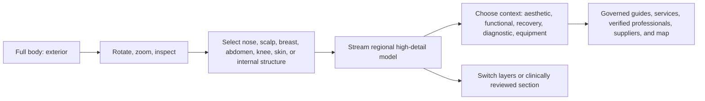

# Hea-lth Ultra-Real 3D Anatomy Acceptance and Vendor Shortlist v1

**Status:** Evidence-gated discovery on 2026-07-11. No vendor has been contacted, contracted, paid, downloaded for production, integrated, or published.

## Decision

Hea-lth will not use a generic stock avatar, a low-poly body, a static anatomy picture, or an AI-generated substitute for the interactive human body. The target is a medically credible, premium, ultra-real 3D body experience with regional detail, internal systems, selected anatomy, layer control, and a legitimate path to web delivery.

"Ultra-real" is a product requirement with two separate dimensions:

1. **Visual realism:** a credible body from every angle, premium materials, detailed regional views, and no mannequin-like shortcuts.
2. **Anatomical realism:** systems that are correctly positioned, separately selectable, named, clinically reviewed for the intended presentation, and truthful in cross-section.

A model that satisfies only one dimension is rejected.

## What the visitor should experience

Selecting the nose, for example, is not a generic click. It opens a detailed nose and facial region with separate learning routes for aesthetic care, nasal breathing, injury or reconstruction, skin, and equipment. The detail is loaded on demand so a visitor does not download an enormous full-resolution anatomy collection before they need it.

## Non-negotiable visual and technical standard

| Area | Required standard | Rejection example |
| --- | --- | --- |
| Exterior body | 360-degree, close-inspection quality with credible silhouette, skin, face, hands, feet, and posture. | A low-detail character that only works in a distant hero animation. |
| Internal anatomy | Named systems that align spatially to the exterior and can be independently isolated. | A painted texture or a single fused mesh with no semantic structure. |
| Region detail | A high-detail asset or authored LOD is streamed for a selected commercial region. | Zooming into a blurry full-body mesh. |
| Materials | Source-owned or licensed PBR materials, documented texture rights, calibrated under the planned light setup. | An untraceable texture, a generated skin image, or a material that only looks credible in a vendor render. |
| Cross-sections | Pre-authored or clinically reviewed sectional geometry, with a source, reviewer, and version. | A raw clipping plane marketed as a medically meaningful internal view. |
| Selection | Stable named mesh and anatomy mapping, with mouse, keyboard, touch, and accessible list fallback. | Screen-coordinate hotspots that break when the model changes. |
| Runtime | Measured LOD, texture, GPU, loading, and fallback behavior on agreed desktop and mobile devices. | Loading the full asset before first interaction with no evidence of real-device performance. |
| Rights | Executed commercial agreement for the exact web delivery and anti-extraction design. | Downloading an attractive marketplace GLB under a generic content licence. |

## Evidence-based shortlist

| Candidate | What is evidenced today | Strength for Hea-lth | Gap to close before selection | Current position |
| --- | --- | --- | --- | --- |
| [Zygote Male and Female Anatomy Collection](https://www.zygote.com/poly-models/3d-human-collections/3d-male-female-anatomy-collection) | Vendor lists 9,899,940 triangles, UVs, textures, hierarchical grouping, CT-based skeletal foundation, and named geometry. It says photo-real colour and bump maps are available as an add-on. | Strongest owned-source path for an ultra-real, custom Hea-lth renderer and regional expansion. | Require visual sample against the Hea-lth art direction, exact real-time web licence, local asset rights, security terms, modification rights, Hebrew localization, support, update policy, and price. | **Priority 1: RFI and sample review** |
| [BioDigital Human](https://www.biodigital.com/product/the-biodigital-human) | Vendor states it provides interactive anatomy, conditions, treatments, more than 14,000 structures, 1,000+ models, web/mobile/AR/VR, embedding, and a business developer-toolkit route. | Fastest serious proof of interaction, layers, labels, and anatomy navigation. | Its public material does not prove owned Hea-lth asset files or the exact visual art direction. Require commercial scope, white-label terms, Hebrew, analytics, provider/map integration, availability, and exit terms. | **Priority 2: platform proof comparison** |
| [Primal Pictures / Anatomy.tv](https://primalpictures.com/) | Public materials say models are derived from real scan data and provide interactive web content. | Strong medical-education comparison and possible licensed embedded-content route. | Require a live visual evaluation, public-commercial embedding rights, Hebrew, product/API scope, white-labeling, pricing, and exit terms. | **Priority 3: RFI candidate** |
| [Complete Anatomy for Web](https://3d4medical.com/fr/blog/new-complete-anatomy-for-web) | Complete Anatomy for Web is available for institutional customers through browser-accessible, deep-linked content. | High bar for web usability, accessibility, and content sharing. | Public evidence is institutional education access, not an open public commercial marketplace integration. Require explicit enterprise capability confirmation. | **Benchmark, not selected vendor** |
| Commissioned medical-visualization package | No vendor chosen. | Maximum art direction, ownership control, localized semantics, and no platform dependency if rights are assigned. | Needs a vetted medical visualization studio, qualified clinical reviewer, reference data, acceptance tests, budget, delivery security, and maintenance plan. | **Long-term ownership route** |

## Why Zygote is the source-quality benchmark

Zygote's public product page lists 9,899,940 triangles for the complete collection, plus UV coordinates, textures, hierarchical grouping, and separate named geometry. Its help page says a real-time software model licence can allow end-user software distribution, while requiring royalty or subscription terms and reasonable protection from extraction. Those facts make it the first vendor to test for a true Hea-lth-owned renderer.

This is not a claim that it is automatically the best commercial choice. It is the strongest current proof that a model at the requested fidelity can be obtained through a commercial route. The visual sample, medical review, contract, cost, security model, and performance test have not yet occurred.

Sources: [Zygote collection specifications](https://www.zygote.com/poly-models/3d-human-collections/3d-male-female-anatomy-collection), [Zygote licensing FAQ](https://www.zygote.com/help), [BioDigital Human product page](https://www.biodigital.com/product/the-biodigital-human), [Complete Anatomy for Web](https://3d4medical.com/fr/blog/new-complete-anatomy-for-web).

## Required vendor proof pack

No commercial selection can be made from an online image, a triangle count, or a sales presentation. Each candidate needs the following proof pack:

1. A live manipulation review of the exact model and its source hierarchy.
2. Full-body, profile, rear, close facial, hand, foot, and first-region visual samples under controllable light.
3. A mesh, LOD, material, texture, rigging, naming, and anatomy-system inventory.
4. A medically reviewed statement that identifies the reviewer, scope, date, and known limitations.
5. A written real-time web, mobile, and future app licence proposal, including Israel, Hebrew, commercial display, derivative work, vendor API usage, and term renewal.
6. An anti-extraction approach that remains compatible with the browser delivery model and does not overpromise DRM.
7. A source-file escrow, portability, or exit plan if the vendor becomes unavailable or pricing changes.
8. A sample asset for private technical validation in the planned renderer before production commitment.
9. A performance proof on a representative desktop, current iPhone-class browser, current Android-class browser, and mid-tier 4G connection.
10. A privacy and analytics statement confirming no health-related visitor data is sent to the 3D vendor without an approved basis.

## Acceptance test before any production use

| Test | Pass condition | Evidence retained |
| --- | --- | --- |
| Visual review | Design, clinical, accessibility, and product owners approve the real model at full body and close regional views. | Dated review record and screenshots from the real asset. |
| Anatomy review | A qualified reviewer signs off the intended public representation, labels, sections, limitations, and update cadence. | Reviewer record, source list, model version. |
| Semantic test | At least 30 sample structures map to stable IDs, Hebrew labels, systems, and content resolver records. | Manifest and automated mapping test. |
| Nose vertical slice | Click, rotate, layer switch, regional detail, context choice, governed results, map filter, and text fallback all work with non-fictional data. | Staging test report and usability observation. |
| Runtime test | First interaction, loading, memory, frame pacing, fallback, and failure states pass agreed targets on representative devices. | Test matrix, recordings, and telemetry. |
| Licensing test | Legal sign-off confirms every delivery, localization, modification, commercial, and anti-extraction right. | Signed agreement and licence matrix. |
| Safety test | The experience does not diagnose, promise outcomes, rank providers unfairly, or collect sensitive data without consent. | Clinical, legal, and privacy review. |

## Recommended next move

Run two controlled vendor tracks in parallel before building production 3D:

1. **Owned-source track:** request a Zygote sample and real-time web licence proposal for an adult exterior, nose region, internal respiratory structures, and the relevant system hierarchy.
2. **Platform track:** request a BioDigital business evaluation that proves its real interaction quality, custom embedding, Hebrew feasibility, analytics boundaries, and public portal terms.

The winning path must beat the standard on visual realism, clinical credibility, web performance, commercial control, and exit safety. A vendor with only a beautiful demo does not pass.

## What is intentionally not done

- No purchased 3D model has been used.
- No generated image is being presented as medical anatomy.
- No generic low-detail model will be used as a temporary stand-in on the public website.
- No production code has been committed, deployed, or attached to WordPress.
